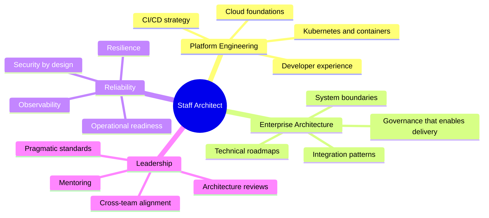
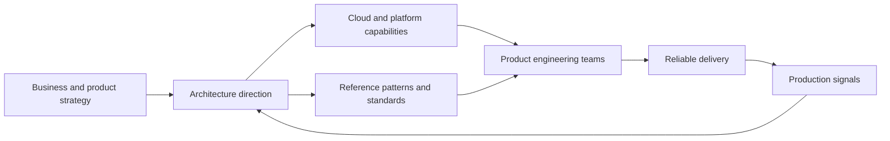

# Hogilber Quintana

### Staff Architect | Cloud Platforms | Enterprise Architecture | Developer Experience

I design and guide systems that need to be reliable, observable, secure, and maintainable at scale. My work sits where architecture strategy, platform engineering, delivery discipline, and hands-on implementation meet.

---

## What I Focus On

I like architecture that survives contact with production: clear ownership, small interfaces, measurable outcomes, and enough automation that teams can move quickly without turning delivery into guesswork.

## Operating Principles

| Principle | How it shows up |
| --- | --- |
| Build for change | Prefer modular boundaries, explicit contracts, and migration paths over one-way doors. |
| Make reliability visible | Use metrics, traces, logs, SLOs, and runbooks as architecture inputs, not afterthoughts. |
| Reduce cognitive load | Standardize the boring parts so teams can focus on product and domain complexity. |
| Govern through enablement | Create paved roads, reference patterns, and reusable templates instead of heavyweight gates. |
| Stay hands-on | Validate architecture with working systems, production signals, and direct developer feedback. |

## Architecture Map

## Tech I Work Around

## Current Architecture Themes

- Platform modernization and standard delivery pipelines
- Cloud-native application patterns and operational readiness
- Secure-by-default infrastructure and deployment workflows
- Developer experience, golden paths, and pragmatic automation
- Architecture decision records, reference implementations, and technical alignment

## GitHub Signals

 

 

 

## How I Like To Collaborate

I work best with teams that value clarity, ownership, and measurable progress. I enjoy turning ambiguous technical problems into decisions, patterns, and delivery paths that engineers can actually use.

When architecture is doing its job, teams ship with fewer surprises, production is easier to understand, and technical strategy becomes visible in the systems people touch every day.

---

_Architecting systems, platforms, and delivery paths that teams can trust._

